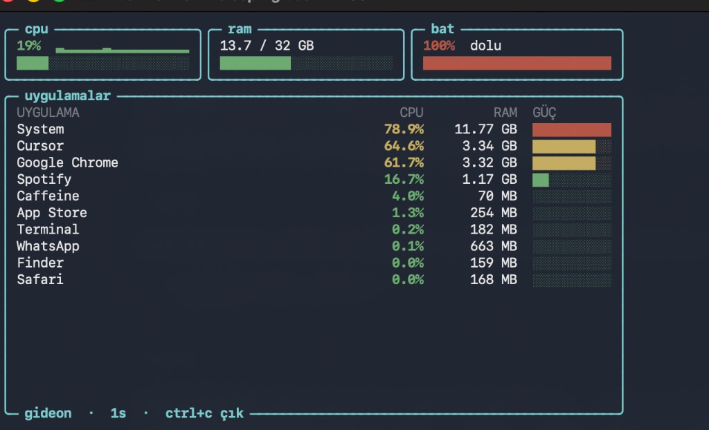
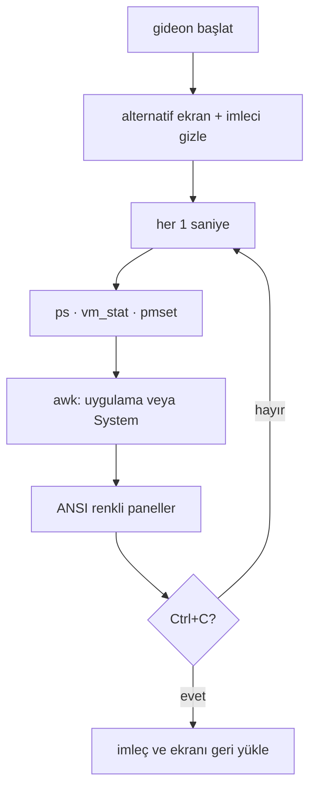
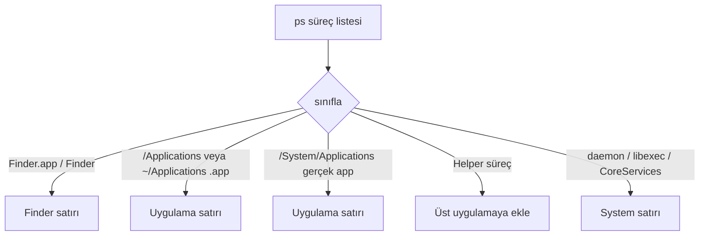

# Gideon

**gideon-monitor** — bpytop-tarzı macOS uygulama monitörü (CPU, RAM, güç, pil).

> Eğlence amaçlı örnek proje — Bora Ata Türkoğlu tarafından oluşturuldu.
>
> A hobby / example project by **Bora Ata Türkoğlu**. Fun first, still useful in a real terminal.



`gideon` yazınca terminal alternatif ekrana geçer; Ctrl+C ile eski haline döner. Sudo yok, ekstra Homebrew paketi yok — sadece macOS’ta zaten duran `zsh`, `ps`, `vm_stat`, `sysctl` ve `pmset`.

## Gereksinimler / Requirements

- **macOS**
- **zsh** (sistemle gelir)
- **Homebrew** isteğe bağlı: PATH’e symlink atmak için. Çalıştırmak için brew paketi gerekmez.
- **sudo yok**

## Kurulum / Install

```bash
git clone https://github.com/boracomet/gideon-monitor.git
cd gideon-monitor
./install.sh
gideon
```

`install.sh` scripti `gideon` dosyasını çalıştırılabilir yapıp Homebrew `bin` altına symlink atar (Apple Silicon’da genelde `/opt/homebrew/bin/gideon`). Brew yoksa script symlink’i atlar; o zaman `./gideon` ile çalıştırabilirsin.

## Kullanım / Usage

| Ne | Nasıl |
| --- | --- |
| Çıkış | **Ctrl+C** |
| Sıralama | Üstteki **cpu** / **ram** paneline veya tablo başlıklarına tıkla |
| Pil renkleri | yeşil ≥ 60 · sarı 25–59 · kırmızı < 25 |
| Şarj | Adaptör takılıyken etiket **şarj etkin** |

### CPU ne anlama geliyor?

- **Üst panel (`cpu`)** — tüm çekirdekler birlikte, **0–100%**. Süreç CPU toplamı / mantıksal çekirdek sayısı.
- **Tablo (`CPU/çek`)** — `ps`’in verdiği **çekirdek başı** `%CPU` (bir uygulama birden fazla çekirdeği doldurursa 100’ü aşabilir).

### Uygulamalar vs System

Listede senin açtığın programlar durur; Mac’in görünmez altyapısı tek satırda toplanır.

- **Ayrı satır:** `/Applications`, `~/Applications`, `/System/Applications` altındaki `.app`’ler; **Finder** her zaman kendi satırında. Helper süreçler (`Google Chrome Helper` → Chrome) üst uygulamaya eklenir.
- **`System`:** `kernel_task`, `launchd`, WindowServer, `/usr/libexec` / `/System/Library` daemon’ları, Dock / Control Center gibi CoreServices araçları.

## Nasıl çalışır / How it works

Her saniye veri toplanır, uygulamalar sınıflanır, ekran ANSI ile yeniden çizilir.



Süreçler `ps` çıktısından şöyle ayrılır:



Güç sütunu gerçek watt değildir (`powermetrics` root ister). CPU ağırlıklı, küçük RAM katkılı göreli bir skor; üstteki **pil** paneli ise `pmset` ile gerçek batarya durumudur.

## Güncelleme / Update

Kurulum bir **symlink** olduğu için kaynak dizinde `git pull` yeter; `gideon` zaten PATH’teyse yeniden kurmana gerek yok.

```bash
cd gideon-monitor
git pull
```

Symlink koptuysa veya ilk kurulumu brew’suz yaptıysan:

```bash
./install.sh
```

## Lisans

Resmi bir lisans dosyası yok — kişisel eğlence / örnek proje. Fork’la, oyna, boz, düzelt.
