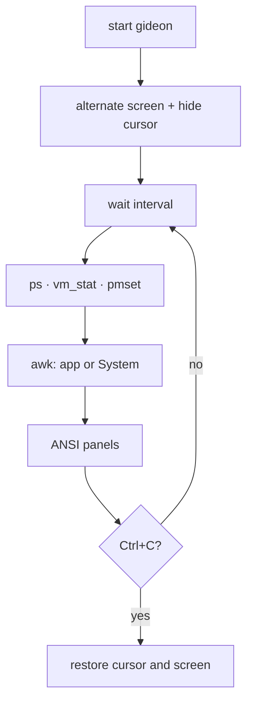
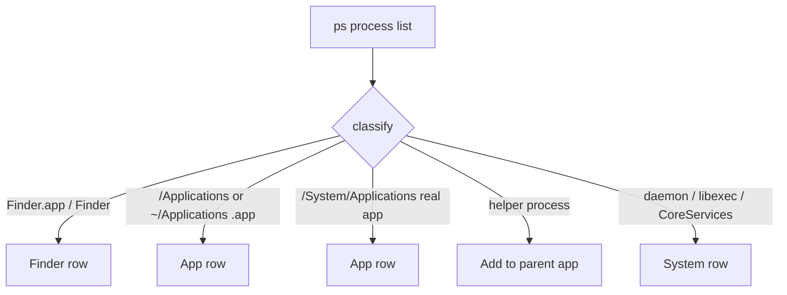
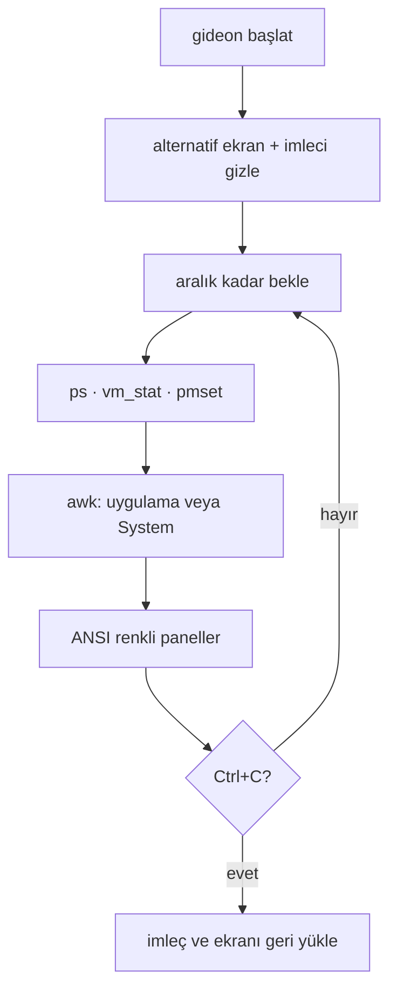

# Gideon

[ English ](#english) | [ Türkçe ](#türkçe)

Hobby [bpytop](https://github.com/aristocratos/bpytop)-style macOS app monitor for CPU, RAM, and battery. Created by **Bora Ata Türkoğlu**.

---

## English

**gideon-monitor** — a terminal UI that lists the apps you actually opened, not dozens of macOS daemons.

> A hobby / example project by **Bora Ata Türkoğlu**. Fun first, still useful in a real terminal.


Type `gideon` and the terminal switches to an alternate screen. Ctrl+C restores it. No sudo, no extra Homebrew packages — only stock macOS `zsh`, `ps`, `vm_stat`, `sysctl`, and `pmset`.

### Requirements

- **macOS**
- **zsh** (comes with the system)
- **Homebrew** optional: only used to symlink `gideon` onto your PATH
- **No sudo**

### Install

```bash
git clone https://github.com/boracomet/gideon-monitor.git
cd gideon-monitor
./install.sh
gideon
```

`install.sh` makes `gideon` executable and symlinks it into Homebrew `bin` (on Apple Silicon usually `/opt/homebrew/bin/gideon`). Without brew, run `./gideon` from the repo.

### Usage

| What | How |
| --- | --- |
| Quit | **Ctrl+C** |
| Sort | Click the top **cpu** / **ram** panel, or the table **CPU** / **RAM** headers (`▼` on the active column) |
| Refresh interval | Click **1s** in the footer: `1s` → `5s` → `30s` → `1 min` → `1s` |
| Language | Click **TR** or **EN** in the footer (default is Turkish) |
| Battery colors | green ≥ 60% · yellow 25–59% · red < 25% (full is green) |
| Charging | Label **charging on** while the adapter is charging |

#### What CPU means

- **Top panel (`cpu · N cores`)** — all cores together, **0–100%**. Process CPU sum / logical CPU count.
- **Table (`CPU/core`)** — `ps` **per-core** `%CPU` (one app can exceed 100% if it uses several cores). This is *not* rescaled to the top-panel total.

#### Apps vs System

The list is the programs you launched; invisible macOS plumbing is one **System** row.

- **Own row:** `.app` bundles under `/Applications`, `~/Applications`, `/System/Applications`; **Finder** always. Helpers (`Google Chrome Helper` → Chrome) roll into the parent app.
- **`System`:** `kernel_task`, `launchd`, WindowServer, `/usr/libexec` / `/System/Library` daemons, Dock / Control Center and other CoreServices tools (except Finder).

### How it works

Data is collected on the chosen interval, processes are classified, and the screen is redrawn with ANSI colors.





The power column is not real watts (`powermetrics` needs root). It is a relative, CPU-weighted score with a small RAM share. The **battery** panel is real `pmset` status.

### Update

Install is a **symlink**, so `git pull` in the repo is enough; no reinstall if `gideon` is already on your PATH.

```bash
cd gideon-monitor
git pull
```

If the symlink is missing:

```bash
./install.sh
```

### License

No formal license file — personal hobby / example project. Fork it, break it, fix it.

---

## Türkçe

**gideon-monitor** — bpytop-tarzı macOS uygulama monitörü (CPU, RAM, güç, pil).

> Eğlence amaçlı örnek proje — **Bora Ata Türkoğlu** tarafından oluşturuldu.


`gideon` yazınca terminal alternatif ekrana geçer; Ctrl+C ile eski haline döner. Sudo yok, ekstra Homebrew paketi yok — sadece macOS’ta duran `zsh`, `ps`, `vm_stat`, `sysctl` ve `pmset`.

### Gereksinimler

- **macOS**
- **zsh** (sistemle gelir)
- **Homebrew** isteğe bağlı: PATH’e symlink için. Çalıştırmak için brew paketi gerekmez.
- **sudo yok**

### Kurulum

```bash
git clone https://github.com/boracomet/gideon-monitor.git
cd gideon-monitor
./install.sh
gideon
```

`install.sh` `gideon` dosyasını çalıştırılabilir yapıp Homebrew `bin` altına symlink atar (Apple Silicon’da genelde `/opt/homebrew/bin/gideon`). Brew yoksa `./gideon` ile çalıştır.

### Kullanım

| Ne | Nasıl |
| --- | --- |
| Çıkış | **Ctrl+C** |
| Sıralama | Üstteki **cpu** / **ram** paneline veya tablo başlıklarına tıkla (aktif sütunda `▼`) |
| Yenileme aralığı | Alttaki **1s** yazısına tıkla: `1s` → `5s` → `30s` → `1 dk` → `1s` |
| Dil | Alttaki **TR** / **EN** (varsayılan Türkçe) |
| Pil renkleri | yeşil ≥ 60 · sarı 25–59 · kırmızı < 25 (dolu yeşil) |
| Şarj | Adaptör şarj ederken etiket **şarj etkin** |

#### CPU ne anlama geliyor?

- **Üst panel (`cpu · N çekirdek`)** — tüm çekirdekler birlikte, **0–100%**. Süreç CPU toplamı / mantıksal çekirdek sayısı.
- **Tablo (`CPU/çek`)** — `ps`’in verdiği **çekirdek başı** `%CPU` (bir uygulama birden fazla çekirdeği doldurursa 100’ü aşabilir). Üst panelle aynı ölçek değildir.

#### Uygulamalar vs System

Listede senin açtığın programlar durur; Mac’in görünmez altyapısı tek **Sistem** satırında toplanır.

- **Ayrı satır:** `/Applications`, `~/Applications`, `/System/Applications` altındaki `.app`’ler; **Finder** her zaman kendi satırında. Helper süreçler (`Google Chrome Helper` → Chrome) üst uygulamaya eklenir.
- **`Sistem`:** `kernel_task`, `launchd`, WindowServer, `/usr/libexec` / `/System/Library` daemon’ları, Dock / Control Center gibi CoreServices araçları (Finder hariç).

### Nasıl çalışır

Seçilen aralıkta veri toplanır, süreçler sınıflanır, ekran ANSI ile yeniden çizilir.



Güç sütunu gerçek watt değildir (`powermetrics` root ister). CPU ağırlıklı, küçük RAM katkılı göreli bir skor; üstteki **pil** paneli `pmset` ile gerçek batarya durumudur.

### Güncelleme

Kurulum bir **symlink** olduğu için kaynak dizinde `git pull` yeter; `gideon` PATH’teyse yeniden kurmana gerek yok.

```bash
cd gideon-monitor
git pull
```

Symlink koptuysa:

```bash
./install.sh
```

### Lisans

Resmi bir lisans dosyası yok — kişisel eğlence / örnek proje. Fork’la, oyna, boz, düzelt.
