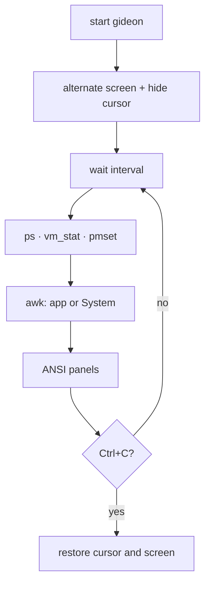
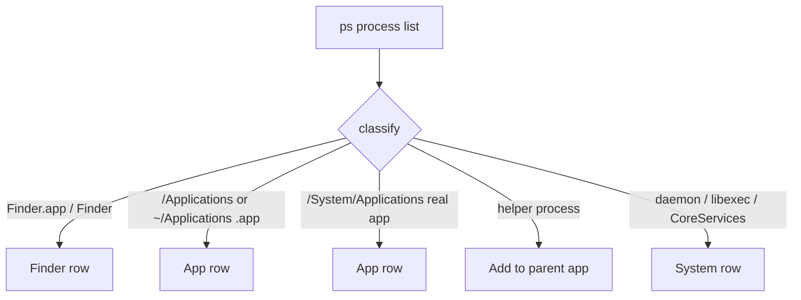

# Gideon

<p align="center">
  
</p>

Hobby [bpytop](https://github.com/aristocratos/bpytop)-style macOS app monitor for CPU, RAM, and battery.

**Created by Bora Ata Türkoğlu.**

`gideon` switches your terminal to an alternate screen. Ctrl+C restores it. No sudo, no extra Homebrew packages — only stock macOS `zsh`, `ps`, `vm_stat`, `sysctl`, and `pmset`.

## Requirements

- **macOS**
- **zsh** (comes with the system)
- **Homebrew** optional: only used to symlink `gideon` onto your PATH
- **No sudo**

## Install

```bash
git clone https://github.com/boracomet/gideon-monitor.git
cd gideon-monitor
./install.sh
gideon
```

`install.sh` makes `gideon` executable and symlinks it into Homebrew `bin` (on Apple Silicon usually `/opt/homebrew/bin/gideon`). Without brew, run `./gideon` from the repo.

## Usage

| What | How |
| --- | --- |
| Quit | **Ctrl+C** |
| Sort | Click the top **cpu** / **ram** panel, the table headers, or **sort: cpu** in the footer (`▼` on the active column) |
| Refresh interval | Click **1s** in the footer: `1s` → `5s` → `30s` → `1 min` → `1s` |
| Language | Click **Language: EN** in the footer to switch to Turkish (`Dil: TR`); click again to return to English |
| Battery colors | green ≥ 60% · yellow 25–59% · red < 25% (full is green) |
| Charging | Label **charging on** while the adapter is charging |

### What CPU means

- **Top panel (`cpu · N cores`)** — all cores together, **0–100%**. Process CPU sum / logical CPU count.
- **Table (`CPU/core`)** — `ps` **per-core** `%CPU` (one app can exceed 100% if it uses several cores). This is *not* rescaled to the top-panel total.

### Apps vs System

The list is the programs you launched; invisible macOS plumbing is one **System** row.

- **Own row:** `.app` bundles under `/Applications`, `~/Applications`, `/System/Applications`; **Finder** always. Helpers (`Google Chrome Helper` → Chrome) roll into the parent app.
- **`System`:** `kernel_task`, `launchd`, WindowServer, `/usr/libexec` / `/System/Library` daemons, Dock / Control Center and other CoreServices tools (except Finder).

## How it works

Data is collected on the chosen interval, processes are classified, and the screen is redrawn with ANSI colors.





The power column is not real watts (`powermetrics` needs root). It is a relative, CPU-weighted score with a small RAM share. The **battery** panel is real `pmset` status.

## Update

Install is a **symlink**, so `git pull` in the repo is enough; no reinstall if `gideon` is already on your PATH.

```bash
cd gideon-monitor
git pull
```

If the symlink is missing:

```bash
./install.sh
```

## License

No formal license file — personal hobby / example project. Fork it, break it, fix it.
